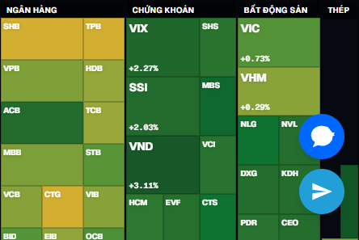

# Sprint 35 — Vietnam Heatmap Rebuild (Fixed Sector Grid)

**Date:** 2026-06-16  
**Scope:** Replace Vietnam sector-mode squarified treemap with FireAnt-style fixed sector grid  
**Build:** `npm run build` ✅  
**Local verify:** `http://localhost:3015` — 87 tiles rendered in sector-grid mode

---

## Summary

Vietnam heatmap **Theo ngành** no longer uses global squarify. A dedicated fixed-sector-grid engine lays out two macro rows (Banking / Securities / Real Estate / Steel, then Oil & Gas / Retail / Technology / KCN / Utilities / Other), packs stocks in per-sector grids with aspect-ratio guards, and renders via `VietnamSectorGridHeatmap`. US and Crypto unchanged (`FinvizTreemap`). **Theo vốn hóa** on Vietnam still uses flat treemap.

**Defaults (unchanged):** Theo ngành + GTGD.

---

## Why the old treemap failed

| Issue | Root cause |
|-------|------------|
| Long horizontal/vertical strips | Global `squarifyGroups` + `squarify` optimizes area fit on one rectangle; sector groups with skewed value distributions produce extreme aspect ratios even with orientation guard (`w/h > 1.6`) and 8% leaf cap |
| One stock dominates | Banking / blue-chips could still occupy large fractions within a sector block before inner squarify |
| Hard to read tickers | Thin strips leave no room for symbol + change % + price tiers |
| Does not match FireAnt | FireAnt uses **fixed sector bands** with internal grids, not a single recursive treemap |
| Hover zoom / expansion | Removed in S32–33 for FinvizTreemap; VN sector grid uses tooltip-only `HeatmapTile` (175ms delay) |

Squarify tuning (S33–S34) improved US/crypto but could not deliver stable sector blocks for VN because layout is **value-driven globally**, not **sector-anchored**.

---

## Architecture

```
MarketHeatmap
├── market=vn && grouping=sector  →  VietnamSectorGridHeatmap  (NEW)
├── market=vn && grouping=marketCap → FinvizTreemap (flat)
└── us / crypto                   → FinvizTreemap (unchanged)
```

**Files added/changed:**

| File | Role |
|------|------|
| `lib/vietnam/vietnam-sector-grid-layout.ts` | Layout engine |
| `components/heatmap/VietnamSectorGridHeatmap.tsx` | Renderer |
| `components/heatmap/MarketHeatmap.tsx` | Routing |
| `lib/i18n.tsx` | `sector.industrial` vi → **KCN** |

**Unchanged:** providers, APIs, color scale (`heatStyle`), data limits.

---

## Sector grid algorithm

### 1. Macro layout (two rows)

**Row 1** (left → right): Banking, Securities, Real Estate, Steel  
**Row 2** (left → right): Oil & Gas, Retail, Technology, Industrial (KCN), Utilities, Other

Empty sectors are omitted. Row heights split by blended weights; columns within each row split horizontally.

```
┌─────────┬─────────┬─────────┬─────────┐  Row 1 (~58% height*)
│ Ngân    │ Chứng   │ Bất động│ Thép    │
│ hàng    │ khoán   │ sản     │         │
├────┬────┼────┬────┼────┬────┼────┬────┤  Row 2 (~42% height*)
│Dầu │Bán │CN  │KCN │Tiện│Khác│    │    │
│khí │lẻ  │    │    │ích │    │    │    │
└────┴────┴────┴────┴────┴────┴────┴────┘
*Typical with live VPS data; exact % from blended weights below
```

### 2. Sector block weights (blended)

```
sectorWeight = 0.60 × normalizedTradingMetric + 0.40 × normalizedFixedImportance
```

**Fixed importance priors** (`SECTOR_IMPORTANCE`):

| Sector | Weight |
|--------|--------|
| Banking | 1.25 |
| Securities | 1.10 |
| Real Estate | 1.05 |
| Steel | 1.00 |
| Oil & Gas | 0.95 |
| Technology | 0.95 |
| Retail | 0.90 |
| Industrial (KCN) | 0.85 |
| Utilities | 0.80 |
| Other | 0.70 |

Trading metric follows active sizing control: **GTGD** (default), **Khối lượng**, or **Vốn hóa**.

### 3. Stock tile weights (inside sector)

```
stockWeight = sqrt(metric)
```

Post-processing per sector:

| Rule | Value |
|------|-------|
| Max tile share | **28%** of sector inner area |
| Min visible tile | **2%** — below → grouped into **Khác** |
| Text tiers | by tile area fraction of container |

### 4. Inner grid packing

Within each sector (below 7% header band):

1. Choose `cols × rows` from √(items × aspect), grow until cell aspect ≤ **3.5**
2. Sort stocks by weight descending
3. Map weight → target cell count; `findPlacement` with col/row span
4. Reject placements with tile aspect > **3.5**; fallback to 1×1 cell
5. Gaps: **0.2%** between sector blocks

### 5. Text tiers

| Tier | Area threshold | Content |
|------|----------------|---------|
| Large | ≥ 4.5% | symbol, change %, price |
| Medium | ≥ 2.0% | symbol, change % |
| Small | ≥ 0.8% | symbol |
| Tiny | < 0.8% | tooltip only |

### 6. Sector labels (always visible)

Vietnamese headers via i18n: Ngân hàng, Chứng khoán, Bất động sản, Thép, Dầu khí, Bán lẻ, Công nghệ, **KCN**, Tiện ích, Khác.

---

## Observed sector dimensions (live data, GTGD)

Measured from layout engine output at `localhost:3015` (normalized 0–1 container):

| Sector | Approx. width | Approx. height | Notes |
|--------|---------------|----------------|-------|
| Ngân hàng | 34.4% | 58.0% | Row 1, largest blended weight |
| Chứng khoán | 22.5% | 58.0% | Row 1 |
| Bất động sản | 21.2% | 58.0% | Row 1 |
| Thép | 21.9% | 58.0% | Row 1 |
| Row 2 sectors | split remaining ~42% height | proportional widths | Dầu khí, Bán lẻ, CN, KCN, Tiện ích, Khác |

**Tiles rendered:** 87 stocks + Khác buckets where applicable.

---

## Controls

| Market | Grouping | Engine |
|--------|----------|--------|
| Vietnam | **Theo ngành** (default) | `VietnamSectorGridHeatmap` |
| Vietnam | Theo vốn hóa | `FinvizTreemap` (flat, squarify) |
| US / Crypto | existing | `FinvizTreemap` |

Sizing pills (VN): **GTGD** (default), Khối lượng, Vốn hóa — passed through to layout metric.

---

## Removed for Vietnam sector mode

- Global squarify for sector grouping
- Long strip layout (replaced by sector grid)
- Hover zoom / hover expansion (tooltip-only interaction)

---

## Visual comparison

### Theo ngành — fixed sector grid (Sprint 35)



Clear sector columns (Ngân hàng, Chứng khoán, Bất động sản, Thép), rectangular tiles, readable tickers and change %.

### Theo vốn hóa — legacy flat treemap (intentionally kept)


Still uses squarify; shows why sector mode was split out. Strips remain in flat mode — acceptable per spec (only sector mode rebuilt).

### Reference targets

- **FireAnt:** fixed sector bands, grid tiles, no single-stock domination
- **Finviz:** squarify treemap — kept for US/crypto and VN market-cap mode

---

## Build result

```text
npm run build
✓ Compiled successfully
✓ Generating static pages
Exit code: 0
```

No new TypeScript or lint errors in:

- `lib/vietnam/vietnam-sector-grid-layout.ts`
- `components/heatmap/VietnamSectorGridHeatmap.tsx`

---

## Test plan

- [x] `npm run build` passes
- [x] VN + Theo ngành renders `data-grouping="sector-grid"` with 80+ tiles
- [x] Sector headers visible (Ngân hàng, Chứng khoán, …)
- [x] VN + Theo vốn hóa still uses FinvizTreemap
- [x] US / Crypto heatmaps unchanged
- [ ] Deploy to production + compare at 1440px / 1920px
- [ ] Side-by-side with FireAnt heatmap on same session

---

## Next steps (optional)

1. Commit + push Sprint 34 + 35 together when ready
2. Consider flat **Theo vốn hóa** cap/guard pass if strips are unacceptable in that mode too
3. Production screenshot archive after Vercel deploy
