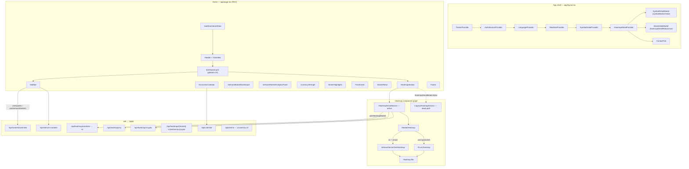

# Structure & Linking Consistency Audit

**Date:** 2026-06-17  
**Scope:** Read-only audit of routing, layout linkage, component graph, API/data flow, config, navigation, typography/cards, and sprint-doc drift  
**HEAD:** `cfc3b0f` — Recovery P1 layout foundation fix  
**Build:** `npm run build` ✅

---

## Executive summary

The codebase is **structurally sound and build-green**. Provider chains, dashboard composition, and heatmap routing are coherent. Remaining issues are **naming drift** (`vn` vs `vietnam`), **duplicate/legacy paths** (heatmap section, dual modals, orphaned treemap component), **split layout source of truth** (CSS grid + inline sidebar widths), and **stale recovery docs** predating the P1 layout fix.

**P0 fixes needed:** **No** — no broken production links or build blockers found.

---

## Architecture diagram



---

## Consistency score by area

| Area | Score | Rationale |
|------|-------|-----------|
| **Layout** | 88/100 | Sprint 34 grid restored in `globals.css` (P1 fix); minor duplication with inline sidebar widths in `page.tsx` |
| **Heatmap** | 74/100 | Active path clear; legacy section, orphaned `SectorTreemap`, dual modal stacks add cognitive load |
| **API / data flow** | 81/100 | Routes work; alias proliferation and `vn`/`vietnam` string drift |
| **i18n** | 83/100 | All used keys defined; 5 nav keys defined but unused in header |
| **Navigation** | 77/100 | Core routes valid; dead CTA, footer stubs, `/markets/*` gated off |

---

## Inconsistency table

| File A says | File B says | Severity |
|-------------|-------------|----------|
| `types/market.ts` → `MarketType = "vn"` | `lib/providers/types.ts` → `MarketHeatmapRegion = "vietnam"` | P1 — type cast in `mappers.ts` (`market.id as MarketHeatmapRegion`) |
| `app/api/heatmaps/vietnam/route.ts` comment: alias for `/api/heatmaps/vn` | `lib/swr/keys.ts` → `heatmapVietnam: "/api/heatmaps/vietnam"` | P2 — works, but canonical path undocumented for clients |
| `lib/market/heatmap.ts` → `MARKET_ALIASES` accepts `vn` and `vietnam` | `HeatmapMarket.id` in providers always `"vn"` | P2 — runtime OK, docs/types diverge |
| `SPRINT34_DASHBOARD_LAYOUT_STABILIZATION.md` → grid in inline Tailwind on `page.tsx` | `app/page.tsx` + `globals.css` → CSS class `.dashboard-grid` | P2 — sprint doc stale |
| `docs/PROJECT_RECOVERY_AUDIT.md` → 1440px right rail 300px, missing 1920 tier | `app/globals.css` (post-`cfc3b0f`) → `240/280 @1440`, `250/300 @1920` | P2 — recovery audit outdated |
| `lib/config/features.ts` → `symbolModal: false` | `app/layout.tsx` still mounts `SymbolDetailProvider`; ticker/overview wire `openDetail` | P2 — dead interaction paths |
| `lib/config/features.ts` → `heatmapDetailModal: true` | `HeatmapSection` skips `LegacyHeatmapSection` entirely | P2 — ~130 lines legacy code unreachable |
| `lib/i18n.tsx` → `nav.markets`, `nav.heatmaps`, `nav.events`, `nav.news`, `nav.watchlist` | `header.tsx` NAV_ITEMS → dashboard, brokers, contact only | P2 — unused translation keys |
| `lib/i18n.tsx` → `nav.brokers` EN = "Platforms" | Route is `/brokers`; `/platforms` redirects | P2 — naming OK but dual labels |
| `config/heatmap-symbols.ts` → `US_HEATMAP_SEEDS` length 100 | `US_HEATMAP_LIMIT = 40` display cap | OK — intentional fetch-universe vs display limit |
| `app/api/events/route.ts` — TradingEconomics calendar | `economic-calendar.tsx` → `useCalendarApi()` → `/api/calendar` | P2 — duplicate calendar backends |
| `lib/swr/keys.ts` → `events: "/api/events"` | No client imports `SWR_KEYS.events` | P2 — dead key |

---

## 1. App routing & pages

| Route | Status | Notes |
|-------|--------|-------|
| `/` | ✅ Dynamic (RSC + providers) | `buildDashboardData()` with mock fallback |
| `/brokers`, `/brokers/[slug]` | ✅ Static | Registry-driven slugs |
| `/compare/[pair]` | ✅ Static | 15 compare pairs in build output |
| `/contact` | ✅ Static | Uses `lib/contact.ts` |
| `/legal/[slug]` | ✅ SSG | 6 slugs match footer links |
| `/login`, `/register` | ✅ Static | Auth flow |
| `/platforms` | ✅ Redirect → `/brokers` | Legacy alias preserved |
| `/markets/[symbol]` | ⚠️ Gated | `features.dynamicMarketPages: false` → `notFound()` at runtime; empty `generateStaticParams` |

**Provider chain (`app/layout.tsx`):**  
`ThemeProvider` → `AuthSessionProvider` → `LanguageProvider` → `RealtimeProvider` → `SymbolDetailProvider` → `HeatmapDetailProvider` → children + conditional modals + `ContactFab` + Vercel Analytics.

**Metadata:** Root layout sets default OG/Twitter; home uses `homeMetadata` from `lib/seo`. Legal pages use `buildPageMetadata`. Default `html lang="vi"` aligned with Sprint 26 default Vietnamese.

---

## 2. Dashboard layout linkage

### Class names ↔ CSS

| `app/page.tsx` class | `globals.css` rule | Match |
|----------------------|-------------------|-------|
| `dashboard-grid` | `.dashboard-grid` grid templates | ✅ |
| `dashboard-sidebar-left` | sticky @1024+, col 1 @1440 | ✅ |
| `dashboard-center` | col 2 | ✅ |
| `dashboard-sidebar-right` | col 2 row 2 @1024; col 3 @1440 | ✅ |

### Breakpoints (current vs Sprint 34)

| Breakpoint | `globals.css` (HEAD) | Sprint 34 spec | Match |
|------------|---------------------|----------------|-------|
| `<1024px` | 1 column | 1 column | ✅ |
| `1024–1439px` | `220px \| 1fr` | `220px \| 1fr` | ✅ |
| `≥1440px` | `240px \| 1fr \| 280px` | same | ✅ |
| `≥1920px` | `250px \| 1fr \| 300px` | same | ✅ |

### Split source of truth (minor)

`page.tsx` also sets `min-[1440px]:w-[240px] min-[1920px]:w-[250px]` on left aside and `280px`/`300px` on right — redundant with grid `grid-template-columns`. Not broken, but two places to edit.

### Sticky offset vars ↔ header heights

| CSS variable | Value | Component |
|--------------|-------|-----------|
| `--dashboard-header-height` | 44px mobile, 48px ≥768 | `header.tsx` `h-11` / `md:h-12` ✅ |
| `--dashboard-mobile-nav-height` | 26px | Mobile nav `h-[26px]` ✅ |
| `--dashboard-ticker-height` | 28px | `ticker-bar.tsx` `max-h-7` (28px) ✅ |
| `--dashboard-top-offset` | sum above | Sticky sidebars `top: var(--dashboard-top-offset)` ✅ |

Mobile total: 44+26+28 = **98px**. Desktop: 48+28 = **76px**. Matches Sprint 34 inline spec.

---

## 3. Component graph

### Marketwall widget imports (home page)

```
page.tsx
├── Header(tickerItems) → TickerBar, AuthButtons, LanguageSwitcher, ThemeToggle
├── Sidebar(overview) → PromoBanner, PartnerBanner, Watchlist, MarketOverview
├── HeatmapSection → HeatmapDetailSection → MarketHeatmap
├── VietnamMarketDashboard → useVietnamMarkets SWR
├── VietnamMarketAnalyticsPanel → useVietnamMarkets SWR
├── CurrencyStrength → useCurrencyStrength SWR
├── BrokerHighlights → static registry
├── FearGreed, MarketNews, EconomicCalendar (right rail)
└── Footer
```

### Heatmap path (active)

```
HeatmapSection
  └─ features.heatmapDetailModal=true
       └─ HeatmapDetailSection
            ├─ useHeatmapMarket("vn"|"us"|"crypto")
            ├─ heatmapRowsToMarketAssets + realtime merge
            └─ MarketHeatmap
                 ├─ vn + sector → VietnamSectorGridHeatmap → HeatmapTile
                 └─ else → FinvizTreemap → HeatmapTile
                      onTileClick → useHeatmapDetail.openAsset → StockDetailModal
```

### Deprecated / duplicate paths

| Artifact | Status | Action |
|----------|--------|--------|
| `LegacyHeatmapSection` in `heatmap.tsx` | Unreachable (`heatmapDetailModal=true`) | Remove in P2 cleanup |
| `HeatGrid` + exchange tabs (legacy VN grid) | Inside legacy section only | Remove with legacy section |
| `components/heatmap/SectorTreemap.tsx` | **Zero production imports** | Remove in P2 |
| `lib/vietnam/sector-treemap-layout.ts` | Used only by orphaned `SectorTreemap` | Remove with SectorTreemap |
| `SymbolDetailModal` + `SymbolDetailProvider` | `symbolModal=false` — modal never rendered | Keep until symbol flow re-enabled |
| `StockDetailModal` | Active heatmap detail path | Canonical for tile clicks |

---

## 4. API & data flow

### Route ↔ provider ↔ hook matrix

| API route | Provider / lib | Client hook | Feature gate |
|-----------|----------------|-------------|--------------|
| `/api/markets/overview` | `market-provider` | `useQuotes` | `liveClientFetch` |
| `/api/vietnam-markets` | `vietnam-market-provider` | `useVietnamMarkets` | `liveClientFetch` |
| `/api/global-markets` | `global-market-provider` | `useGlobalMarkets` | `liveClientFetch` |
| `/api/crypto` | `crypto-provider` | `useCryptoMarkets` | `liveClientFetch` |
| `/api/heatmaps/vietnam` | `lib/market/heatmap` → `serveHeatmapMarket("vn")` | `useHeatmapMarket("vn")` | `liveClientFetch` |
| `/api/heatmaps/us` | same | `useHeatmapMarket("us")` | same |
| `/api/heatmaps/crypto` | same | `useHeatmapMarket("crypto")` | same |
| `/api/heatmaps/[market]` | `resolveHeatmapMarketParam` (vn/vietnam/us/crypto) | — (not used by SWR) | — |
| `/api/currency-strength` | `lib/market/currency-strength` | `useCurrencyStrength` | `currencyStrength` + `liveClientFetch` |
| `/api/calendar` | `calendar-provider` | `useCalendarApi` | `liveClientFetch` |
| `/api/news` | news provider | `useNewsApi` | `liveClientFetch` |
| `/api/events` | TradingEconomics direct | **none** | dead |
| `/api/realtime/stream` | `ws-relay` | `RealtimeProvider` | `realtimeStream` |
| `/api/vietnam/chart/[symbol]` | `vietnam-chart-provider` | `useVietnamChart` | per-symbol |

### Market type strings

| Context | String | Files |
|---------|--------|-------|
| API param / cache / UI tabs | `"vn"` | `types/market.ts`, heatmap routes, SWR hooks |
| Provider region type | `"vietnam"` | `lib/providers/types.ts` `MarketRegion`, `MarketHeatmapRegion` |
| URL alias | `"vietnam"` | `/api/heatmaps/vietnam`, `MARKET_ALIASES.vietnam → vn` |
| Broker category | `"vn"` | `types/broker.ts` |

**Risk:** `heatmapMarketToMarketHeatmap` casts `"vn"` to `MarketHeatmapRegion` (`"vietnam"`) — TypeScript allows via assertion; runtime consumers comparing `id === "vietnam"` would fail.

---

## 5. Config & constants

| Config | Consumer | Aligned |
|--------|----------|---------|
| `config/heatmap-symbols.ts` limits | `lib/market/heatmap-limits.ts` `HEATMAP_DISPLAY_LIMIT` | ✅ |
| `VN_HEATMAP_LIMIT=200` | VPS batch fetch + display cap | ✅ |
| `US_HEATMAP_SEEDS` (100) vs `US_HEATMAP_LIMIT` (40) | Fetch broad, serve top 40 by mcap/volume | ✅ documented |
| `lib/config/features.ts` | Layout modals, SWR gates, sitemap market routes | ✅ flags match usage except `symbolModal` dead wiring |

### Feature flags vs usage

| Flag | Value | Actual usage |
|------|-------|--------------|
| `symbolModal` | false | Ticker/overview clicks disabled; provider still mounted |
| `heatmapDetailModal` | true | Active; legacy heatmap section bypassed |
| `watchlist` | true | Sidebar watchlist rendered |
| `liveClientFetch` | true | All SWR market hooks enabled |
| `realtimeStream` | true | RealtimeProvider + merge in heatmap/ticker |
| `currencyStrength` | true | Home page conditional section |
| `dynamicMarketPages` | false | `/markets/[symbol]` returns 404 |

---

## 6. Navigation & links

### Header nav

| Label key | href | Active match |
|-----------|------|--------------|
| `nav.dashboard` | `/` | pathname `/` |
| `nav.brokers` | `/brokers` | pathname `/brokers` |
| `nav.contact` | `/contact` | pathname `/contact` |

### Footer legal links → routes

All 6 footer legal hrefs match `lib/legal-content.ts` slugs and `generateStaticParams`. ✅

### Broken or risky links

| Location | Issue | Severity |
|----------|-------|----------|
| `heatmap.tsx` "View full heatmap" button | `Button variant="link"` with **no `href`** — non-functional CTA | P1 UX |
| Footer "About", "Advertise", "Careers" | All → `/contact` | P2 — placeholder |
| `market-news.tsx` external URLs | `href={n.url ?? "#"}` — `#` fallback if missing | P2 |
| `/markets/[symbol]` linked from `SymbolDetailModal` | Target 404 while `dynamicMarketPages=false` | P1 when symbol modal re-enabled |
| Search input in header | No wiring / no route | P2 — decorative |

### Valid redirects

- `/platforms` → `/brokers` ✅
- Broker CTAs → `/api/brokers/redirect?slug=...` ✅

---

## 7. Typography & card patterns (consistency)

| Pattern | Where | Consistent |
|---------|-------|------------|
| Section titles | `SectionHeading` in `shared.tsx` (`text-sm sm:text-base`) | Partial — used in most widgets |
| Price display | `font-mono tabular-nums` | ✅ widespread |
| Micro copy | Mix of `text-[10px]`, `text-[11px]`, `text-xs` | ⚠️ no shared scale token |
| Cards | Shadcn `Card` vs custom bordered panels | ⚠️ mixed (currency/broker vs VN panels) |
| Heatmap tiles | Local tier sizing in `HeatmapTile` / layout engine | ✅ self-contained |

No redesign required; documented for future normalization sprint.

---

## 8. Git / sprint doc drift

| Document | Claims | Current code (HEAD) |
|----------|--------|---------------------|
| `docs/PROJECT_RECOVERY_AUDIT.md` | Grid regression: 300px right @1440, no 1920 tier | **Fixed** in `cfc3b0f` — audit is stale |
| `SPRINT34_DASHBOARD_LAYOUT_STABILIZATION.md` | Grid values inline in `page.tsx` | Grid in `globals.css`; widths only on aside |
| `docs/PROJECT_SPEC.md` | Heatmap APIs at `app/api/heatmaps/[market]/route.ts` (+ legacy) | Still accurate; adds `/vietnam` alias |
| `SPRINT36B_TWO_LEVEL_VN_HEATMAP.md` | Two-level VN squarify | Active via `VietnamSectorGridHeatmap` |

**Recommendation:** Update `PROJECT_RECOVERY_AUDIT.md` P1 section to ✅ after this audit, or link to this file.

---

## Deprecated paths to remove later

1. `LegacyHeatmapSection`, `HeatGrid`, legacy tile helpers in `components/marketwall/heatmap.tsx`
2. `components/heatmap/SectorTreemap.tsx` + `lib/vietnam/sector-treemap-layout.ts`
3. `app/api/events/route.ts` OR consolidate with `/api/calendar`
4. `SWR_KEYS.events` in `lib/swr/keys.ts`
5. `SymbolDetailModal` stack if `symbolModal` stays permanently off
6. Deprecated aliases in `vietnam-sector-grid-layout.ts` (`buildVietnamSectorGridLayout`, etc.)
7. `hooks/use-market-apis.ts` deprecated exports `useMarketQuotes`, `useCurrencyStrengthApi`

---

## Priority fix list

### P0 — none

Build passes. Production routes load. No critical broken internal links.

### P1 — should fix soon

1. **Normalize `vn` vs `vietnam`** — single canonical ID in types (`MarketType` everywhere, or explicit mapper); remove unsafe cast in `mappers.ts`.
2. **Wire or remove "View full heatmap" CTA** — add route (e.g. `/heatmaps`) or remove button to avoid dead UI.
3. **Update `docs/PROJECT_RECOVERY_AUDIT.md`** — mark layout P1 as resolved (`cfc3b0f`).
4. **When re-enabling `symbolModal`** — enable `dynamicMarketPages` or change modal full-page link target.

### P2 — cleanup / consistency

1. Remove unreachable `LegacyHeatmapSection` (~130 lines in `heatmap.tsx`).
2. Delete orphaned `SectorTreemap` component and `sector-treemap-layout.ts`.
3. Consolidate calendar API (`/api/events` vs `/api/calendar`).
4. Point SWR heatmap key to canonical `/api/heatmaps/vn` (keep `/vietnam` alias).
5. Remove unused i18n nav keys or add nav items.
6. Deduplicate sidebar width: rely on CSS grid only, drop inline `min-[1440px]:w-[*]` on `page.tsx`.
7. Prune deprecated SWR hook aliases after confirming zero imports.

---

## Verification

- [x] Local build passed (`npm run build`)
- [x] App routes enumerated from build output (43 pages)
- [x] Heatmap graph traced end-to-end
- [x] Layout CSS matches Sprint 34 contract post-P1 fix
- [x] Footer/legal/broker links cross-checked
- [ ] Vercel production deploy (out of scope for this doc-only commit)

---

## Files changed (this audit)

| File | Change |
|------|--------|
| `docs/STRUCTURE_CONSISTENCY_AUDIT.md` | Added — this document |
